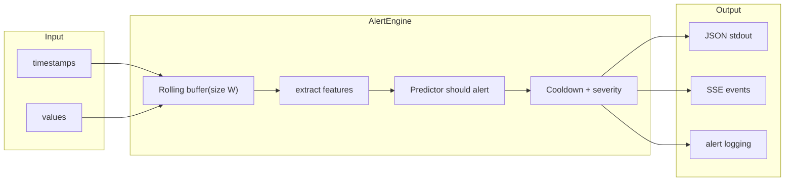

# Predictive Cloud Alerting Service

A production-ready pipeline that predicts incidents in cloud services before they occur, using historical metric data from AWS CloudWatch.

## Table of Contents

- [Architecture](#architecture)
  - [Predict / Stream (real-time alerting)](#predict--stream-real-time-alerting)
- [Quick Start](#quick-start)
  - [Prerequisites](#prerequisites)
  - [Train the model](#train-the-model)
  - [Evaluate a saved model](#evaluate-a-saved-model)
  - [Run the alerting pipeline](#run-the-alerting-pipeline)
  - [Stream input and SSE output](#stream-input-and-sse-output)
  - [Docker](#docker)
- [How It Works](#how-it-works)
  - [Problem Formulation](#problem-formulation)
  - [Feature Set (8 features)](#feature-set-8-features)
  - [Labeling](#labeling)
  - [Alert Engine](#alert-engine)
  - [Dataset](#dataset)
- [Design Decisions](#design-decisions)
- [Limitations and Future Work](#limitations-and-future-work)

## Architecture

The system is split into two layers:

- **ML layer** (`src/ml/`) -- stateless, pure functions: feature extraction, model training, evaluation, inference. Swap the model without touching the pipeline.
- **Pipeline layer** (`src/pipeline/`) -- owns state and I/O: data ingestion, rolling-window alert engine with cooldown logic, structured JSON notification output.

### Predict / Stream (real-time alerting)



## Quick Start

### Prerequisites

- Python 3.12+
- Dependencies: `pip install -r requirements.txt`

### Train the model

```bash
python cli.py train
```

This downloads 17 AWS CloudWatch time series from the NAB dataset, extracts features, and trains:

- **Global model** — one model on all series (saved under `artifacts/models/global/`).
- **Per-metric models** — one model per metric type: `ec2_cpu`, `ec2_disk`, `ec2_network`, `elb`, `asg`, `rds_cpu` (saved under `artifacts/models/{key}/`).

Each run also evaluates and writes reports to `artifacts/reports/` (global) and `artifacts/reports/{key}/` (per-metric). A `manifest.json` in `artifacts/models/` lists all trained model keys.

### Evaluate a saved model

```bash
python cli.py evaluate
```

### Run the alerting pipeline

```bash
python cli.py predict --source ec2_cpu_utilization_fe7f93
```

The CLI selects the model automatically: if a per-metric model exists for that source (e.g. `ec2_cpu` for CPU utilization series), it is used; otherwise the global model is used. Streams through the time series chronologically and fires structured JSON alerts to stdout when the model predicts an incident:

```json
{"timestamp": "2014-02-17T00:17:00", "source": "ec2_cpu_utilization_fe7f93", "probability": 0.9653, "severity": "critical", "message": "Predicted incident within 15 minutes"}
```

### Stream input and SSE output

Read a metrics file in a stream (line-by-line) and emit **Server-Sent Events (SSE)** when the predicted probability crosses the threshold:

```bash
python cli.py stream --input path/to/metrics.csv --source my-service
```

Input CSV must have two columns: `timestamp`, `value`. Use `-` for stdin:

```bash
cat metrics.csv | python cli.py stream --input - --source my-service
```

SSE output (one event per alert):

```
event: alert
data: {"timestamp": "2024-01-15T12:00:00", "source": "my-service", "probability": 0.85, "severity": "warning", "message": "Predicted incident within 15 minutes"}

```

You can point an EventSource (or any SSE client) at a process that runs this and pipes stdout; or wrap it in an HTTP endpoint that sets `Content-Type: text/event-stream` and streams the same output.

**Alert log (archival):** For both `predict` and `stream`, use `--alert-log PATH` to append every alert as a JSON line to a file for archival:

```bash
python cli.py stream --input metrics.csv --alert-log alerts.jsonl
```

### Docker

```bash
docker build -t cloud-alerting .
docker run -v $(pwd)/artifacts:/app/artifacts cloud-alerting train
docker run -v $(pwd)/artifacts:/app/artifacts cloud-alerting predict --source ec2_cpu_utilization_fe7f93
```

## How It Works

### Problem Formulation

Binary time-series classification: given the last **W=24** observations (2 hours at 5-minute intervals), predict whether an incident will start within the next **H=3** steps (15 minutes).

### Feature Set (8 features)

| Feature | Description |
|---------|-------------|
| `mean` | Mean value over the window |
| `std` | Standard deviation |
| `min` / `max` | Range boundaries |
| `trend_slope` | Linear regression slope (is the metric rising or falling?) |
| `mean_change` | Average step-to-step change |
| `max_abs_change` | Largest single-step jump |
| `autocorr_lag1` | Lag-1 autocorrelation (is the signal smooth or noisy?) |

### Labeling

- **label=1** (onset): timestamp is within H steps before an incident window
- **label=-1** (incident in progress): excluded from training to avoid data leakage
- **label=0** (normal): everything else

### Alert Engine

The alert engine (`src/pipeline/alert_engine.py`) processes data points one at a time:

1. Appends value to a rolling buffer of size W
2. Extracts features from the buffer
3. Runs model inference
4. Checks threshold + cooldown (suppresses duplicate alerts for 10 steps after firing)
5. Classifies severity: `critical` (p >= 0.80) or `warning` (p >= threshold)

### Dataset

[Numenta Anomaly Benchmark (NAB)](https://github.com/numenta/NAB) -- `realAWSCloudwatch` subset (17 time series covering EC2 CPU, disk, network, ELB, and RDS metrics).

## Design Decisions

- **XGBoost over deep learning**: fast to train, interpretable feature importances, works well with small datasets and tabular features. No GPU required.
- **Univariate approach**: each metric stream is modeled independently. Keeps the pipeline simple and allows per-metric alerting without cross-metric dependencies.
- **Temporal split (70/15/15)**: chronological ordering preserved with a W-step gap between splits to prevent data leakage.
- **Cooldown logic**: prevents alert storms. After firing, the engine suppresses for N steps before allowing another alert on the same source.
- **Structured JSON stdout**: composable with any log aggregator (CloudWatch Logs, ELK, Datadog). No vendor lock-in.

## Limitations and Future Work

- **Class imbalance**: only ~0.15% of training samples are positive. Current `scale_pos_weight` helps but more sophisticated sampling (SMOTE, undersampling) or loss functions could improve recall.
- **Univariate only**: cross-metric correlation (e.g., CPU spike + network drop) could improve prediction accuracy.
- **Static threshold**: a per-source adaptive threshold based on historical alert patterns could reduce false positives.
- **NAB dataset only**: integrating real CloudWatch data requires swapping `src/pipeline/ingest.py` -- the pipeline architecture supports this without other changes.
