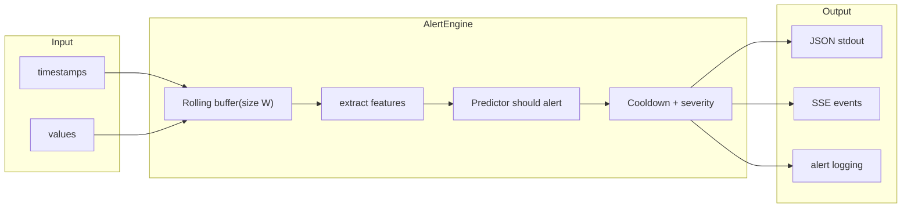

# Predictive Cloud Alerting Service

A production-ready pipeline that predicts incidents in cloud services before they occur, using historical metric data from AWS CloudWatch. This solution is provided as a **public GitHub repository** (add your repo link here).

**Task alignment:** The implementation uses a **sliding-window formulation** (last **W** steps predict incident within **H** steps), trains with a standard ML framework (XGBoost), and supports both a **public dataset** (NAB) and **synthetic time series with labeled incident intervals**. The README documents **modeling choices**, the **evaluation setup** (alert thresholds and metrics), **results analysis**, **design decisions**, **limitations**, and **how to adapt to a real alerting system**.

## Table of Contents

- [Architecture](#architecture)
  - [Predict / Stream (real-time alerting)](#predict--stream-real-time-alerting)
- [Quick Start](#quick-start)
  - [Prerequisites](#prerequisites)
  - [Train the model](#train-the-model)
  - [Evaluate a saved model](#evaluate-a-saved-model)
  - [Run the alerting pipeline](#run-the-alerting-pipeline)
  - [Stream input and SSE output](#stream-input-and-sse-output)
  - [Docker](#docker)
- [ML Pipeline](#ml-pipeline)
  - [Problem Formulation](#problem-formulation)
  - [Step 1: Data and Labeling](#step-1-data-and-labeling)
  - [Step 2: Feature Extraction](#step-2-feature-extraction)
  - [Step 3: Handling Class Imbalance (SMOTE)](#step-3-handling-class-imbalance-smote)
  - [Step 4: Model Training (XGBoost)](#step-4-model-training-xgboost)
  - [Step 5: Threshold Tuning](#step-5-threshold-tuning)
  - [Step 6: Evaluation](#step-6-evaluation)
  - [Alert Engine](#alert-engine)
- [Synthetic Data Generation](#synthetic-data-generation)
  - [Why synthetic data?](#why-synthetic-data)
  - [How it works](#how-it-works)
  - [Why this works](#why-this-works)
- [Design Decisions](#design-decisions)
- [Limitations and Future Work](#limitations-and-future-work)
- [Adapting to a real alerting system](#adapting-to-a-real-alerting-system)

## Architecture

The system is split into two layers:

- **ML layer** (`src/ml/`) -- stateless, pure functions: feature extraction, model training, evaluation, inference. Swap the model without touching the pipeline.
- **Pipeline layer** (`src/pipeline/`) -- owns state and I/O: data ingestion, rolling-window alert engine with cooldown logic, structured JSON notification output.

### Predict / Stream (real-time alerting)



## Quick Start

### Prerequisites

- Python 3.12+
- Dependencies: `pip install -r requirements.txt`

### Train the model

**Synthetic data (recommended -- realistic patterns, strong results):**

```bash
python cli.py train --dataset synthetic
```

**NAB AWS data (real CloudWatch metrics, weaker signal):**

```bash
python cli.py train --dataset aws
```

The default (`aws`) downloads 17 AWS CloudWatch time series from the NAB dataset. The `synthetic` option generates 10 simulated cloud services with realistic pre-incident ramp-up patterns (CPU, memory, latency, error rate) that the model can learn from.

Both paths produce a global model under `artifacts/models/global/` with evaluation reports in `artifacts/reports/`. The AWS path also trains per-metric models (`ec2_cpu`, `ec2_disk`, etc.) under `artifacts/models/{key}/`.

### Evaluate a saved model

```bash
python cli.py evaluate
```

### Run the alerting pipeline

**On NAB AWS data** (after `train --dataset aws`):

```bash
python cli.py predict --source ec2_cpu_utilization_fe7f93
```

**On synthetic data** (after `train --dataset synthetic`):

```bash
python cli.py predict --dataset synthetic --source cpu_web_server
```

The CLI selects the model automatically: if a per-metric model exists for that source (e.g. `ec2_cpu` for CPU utilization series), it is used; otherwise the global model is used. Streams through the time series chronologically and fires structured JSON alerts to stdout when the model predicts an incident:

```json
{"timestamp": "2014-02-17T00:17:00", "source": "ec2_cpu_utilization_fe7f93", "probability": 0.9653, "severity": "critical", "message": "Predicted incident within 60 minutes"}
```

### Stream input and SSE output

Read a metrics file in a stream (line-by-line) and emit **Server-Sent Events (SSE)** when the predicted probability crosses the threshold. Input CSV must have two columns: `timestamp`, `value`. The model must have been trained with the current pipeline (so `artifacts/models/global/feature_stats.json` exists) for stream to score correctly.

**Using the included sample file** (generate it first, then run stream; use a model trained with `train --dataset synthetic` for best results):

```bash
python scripts/generate_sample_metrics.py -o sample_metrics.csv
python cli.py stream --input sample_metrics.csv --source sample-service
```

Use `-` for stdin:

```bash
cat metrics.csv | python cli.py stream --input - --source my-service
```

**Debugging:** If no alerts fire, use `--debug` to log probabilities and the max probability seen (so you can compare to the alert threshold):

```bash
python cli.py stream --input sample_metrics.csv --source sample-service --debug
```

SSE output (one event per alert):

```
event: alert
data: {"timestamp": "2024-01-15T12:00:00", "source": "my-service", "probability": 0.85, "severity": "warning", "message": "Predicted incident within 60 minutes"}

```

You can point an EventSource (or any SSE client) at a process that runs this and pipes stdout; or wrap it in an HTTP endpoint that sets `Content-Type: text/event-stream` and streams the same output.

**Alert log (archival):** For both `predict` and `stream`, use `--alert-log PATH` to append every alert as a JSON line to a file for archival:

```bash
python cli.py stream --input metrics.csv --alert-log alerts.jsonl
```

### Docker

```bash
docker build -t cloud-alerting .
docker run -v $(pwd)/artifacts:/app/artifacts cloud-alerting train --dataset synthetic
docker run -v $(pwd)/artifacts:/app/artifacts cloud-alerting predict --dataset synthetic --source cpu_web_server
```

## ML Pipeline

### Problem Formulation

Binary time-series classification: given the last **W=24** observations (2 hours at 5-min intervals), predict whether an incident will start within the next **H=12** steps (60 minutes).

This is a **hard** problem: incidents in cloud metrics are rare events with weak precursors. The pipeline uses several techniques to handle this.

### Step 1: Data and Labeling

Two dataset options (selected via `--dataset` flag):

**Synthetic data** (`--dataset synthetic`): 10 simulated cloud services generated by `src/ml/synthetic.py`. See [Synthetic Data Generation](#synthetic-data-generation) below for how and why.

**NAB AWS data** (`--dataset aws`): [Numenta Anomaly Benchmark](https://github.com/numenta/NAB) `realAWSCloudwatch` subset (17 real time series covering EC2 CPU, disk, network, ELB, and RDS metrics). These anomalies are mostly sudden spikes with weak precursors.

**Labels** (from `src/ml/features.label_series`):

- **label=1** (onset): timestamp is within H=12 steps before an incident window (~60 minutes of pre-incident examples per incident).
- **label=-1** (incident in progress): **excluded from training** to prevent data leakage.
- **label=0** (normal): everything else.

### Step 2: Feature Extraction

For each time step, we look at the **last W=24 values** and compute **11 statistical features** (from `src/ml/features.extract_features`):

| Feature | What it captures |
|---------|------------------|
| `mean` | Average level in the window |
| `std` | Volatility / noise level |
| `min` / `max` | Range boundaries |
| `trend_slope` | Linear trend direction (rising or falling) |
| `mean_change` | Average step-to-step change |
| `max_abs_change` | Largest single-step jump (spike detection) |
| `autocorr_lag1` | Lag-1 autocorrelation (smooth vs noisy) |
| `range` | max - min (spread of the window) |
| `last_value` | Most recent value (where the metric is right now) |
| `coeff_of_var` | std / mean (scale-independent volatility) |

**Feature normalization:** Raw features are computed per window. At **training** time we compute global mean and std over the training set, z-score normalize train/val, and save these stats to `artifacts/models/global/feature_stats.json` (and per-metric dirs for AWS). At **inference** (predict/stream), the Predictor loads `feature_stats.json` and normalizes incoming features so the model sees the same scale as in training. This avoids train/serve skew when streaming arbitrary metrics.

### Step 3: Handling Class Imbalance (SMOTE)

Even with H=12, positives are ~0.6% of training data. We use **SMOTE** (Synthetic Minority Oversampling Technique) to create synthetic positive examples by interpolating between existing ones in feature space. After SMOTE, the training set is **perfectly balanced** (50/50 positive/negative).

### Step 4: Model Training (XGBoost)

**Algorithm:** XGBoost (gradient-boosted decision trees).

**Why XGBoost:**

- Fast to train (seconds, not hours). No GPU required.
- Works well with tabular features and small datasets.
- Interpretable: you can inspect feature importances.
- Production-proven: widely used in industry for similar problems.

**Hyperparameters:** 800 trees, learning rate 0.03, max depth 4, subsample 0.9, colsample 0.9.

**Model structure:** `python cli.py train` produces:

- A **global model** trained on all 17 series (strongest due to most data).
- **Per-metric models** trained on series of the same type (ec2_cpu, ec2_disk, ec2_network, elb, asg, rds_cpu). At inference, the per-metric model is used if available; otherwise global.

### Step 5: Threshold Tuning

The model outputs a **probability** (0 to 1). We need a **threshold** to convert this into a yes/no alert decision.

Instead of using the default 0.5, we **sweep thresholds on the validation set** and pick the one that:

1. Maximizes **recall** (fraction of pre-incident windows correctly flagged) while
2. Keeping **false positive rate below 15%**.

If no threshold meets the 80% recall target, the best available is used (or falls back to best-F1).

### Step 6: Evaluation

**Point-level metrics:** Precision, Recall, FPR, AUC-ROC, AUC-PR.

**Incident-level metrics** (what matters operationally):

- **Incident recall:** For each real incident in the test set, did the model fire at least one alert before it started?
- **Lead time:** How many steps before the incident the first alert fired.

**Results (synthetic dataset -- global model):**

| Metric | Value |
|--------|-------|
| AUC-ROC | 0.88 |
| AUC-PR | 0.75 |
| Point recall | 79.9% |
| FPR | 14.0% |
| Incident recall | **100%** (17/17 test incidents detected) |
| Avg lead time | 9.9 steps (~50 min early warning) |

**Results (NAB AWS dataset -- global model):**

| Metric | Value |
|--------|-------|
| AUC-ROC | 0.48 |
| Incident recall | 20% (1/5 test incidents) |
| Note | NAB anomalies are mostly sudden spikes with no learnable precursor |

### Alert Engine

The alert engine (`src/pipeline/alert_engine.py`) processes data points one at a time:

1. Appends value to a rolling buffer of size W
2. Extracts features from the buffer
3. Runs model inference
4. Checks threshold + cooldown (suppresses duplicate alerts for 10 steps after firing)
5. Classifies severity: `critical` (p >= 0.80) or `warning` (p >= threshold)

## Synthetic Data Generation

### Why synthetic data?

The NAB dataset contains real AWS CloudWatch metrics, but its anomalies are mostly **sudden spikes** -- the metric looks perfectly normal at time T and then jumps to an extreme value at T+1. There is no gradual buildup the model can learn to recognize before the incident starts.

Real production incidents are different. A CPU saturation event typically shows a gradual ramp-up over 30-60 minutes. A memory leak causes a slow linear increase before an OOM kill. Latency degrades exponentially before timeouts cascade. Error rates climb in steps as retries pile up. These patterns **do** have learnable precursors, and that is what a predictive alerting system should detect.

We generate synthetic data that models these realistic degradation patterns so the ML pipeline has meaningful signal to learn from, while the NAB data remains available as a "hard mode" baseline.

### How it works (`src/ml/synthetic.py`)

The generator creates **10 services x 4000 time steps** (5-min intervals, ~14 days each) with **12 incidents per service** spread evenly across the timeline. Each service simulates a different cloud metric:

| Service | Baseline | Pre-incident pattern | Incident |
|---------|----------|---------------------|----------|
| `cpu_web_server` | ~30% utilization | Linear ramp to 70%+ | Spike to 95% |
| `cpu_api_server` | ~40% | Linear ramp | Spike to 95% |
| `latency_gateway` | ~50ms | Exponential increase | Spike to 200ms+ |
| `error_rate_auth` | ~0.5% | Step-wise escalation | Jump to 8%+ |
| `cpu_worker` | ~25% | Linear ramp | Spike to 95% |
| `mem_cache_server` | ~60% | Exponential increase | Spike to 100% |
| `cpu_db_replica` | ~35% | Linear ramp | Spike to 95% |
| `network_ingress` | ~100 MB/s | Exponential increase | Spike to 400+ |
| `error_rate_payment` | ~10 errors/min | Step-wise escalation | Jump to 40+ |
| `cpu_scheduler` | ~45% | Linear ramp | Spike to 95% |

Each time step consists of:

1. **Normal regime**: `baseline + daily_sinusoidal_pattern + gaussian_noise`. The sinusoidal component simulates daily traffic patterns (peak during business hours, low at night).
2. **Pre-incident ramp-up** (12 steps before each incident): the metric increases gradually using one of three patterns:
   - **Linear**: steady climb (e.g. CPU saturation under increasing load)
   - **Exponential**: slow start, accelerating increase (e.g. memory leak compounding)
   - **Step-wise**: discrete jumps in thirds (e.g. error rate climbing as retry waves hit)
3. **Incident** (10-30 steps): the metric is pinned at a high value with low noise.
4. **Recovery** (20 steps): exponential decay back to baseline.

The 12 incidents are placed at **evenly-spaced intervals** across the series so that the 70/15/15 temporal split puts incidents in all three sets (train, validation, test). This is critical -- if incidents only appear in the training set, the model can't be evaluated.

### Why this works

The key insight is that the 12-step ramp-up creates a **consistent, learnable signal** in the sliding-window features. As the metric ramps up, `trend_slope` increases, `mean` rises above its z-score norm, `range` widens, and `coeff_of_var` changes. These feature shifts form a pattern the XGBoost model can separate from normal windows. With 12 incidents x 10 services x 12 onset-labeled steps = **~1440 positive training examples** (vs ~63 in NAB), the model has enough signal to generalize.

## Design Decisions

- **XGBoost over deep learning**: fast to train, interpretable, works with small data. No GPU required.
- **SMOTE over random oversampling**: creates plausible synthetic examples in feature space rather than duplicating existing ones.
- **Saved feature stats at training, applied at inference**: global mean/std saved to `feature_stats.json` and applied in the Predictor so stream/predict inputs match the training distribution.
- **H=12 (60 min horizon)**: balances early warning with having enough positive samples for learning.
- **Threshold tuned for recall under FPR cap**: directly optimizes the operational metric (catch incidents) with an acceptable false alarm rate.
- **Univariate approach**: each metric stream is modeled independently. Keeps the pipeline simple and allows per-metric alerting.
- **Temporal split (70/15/15)**: chronological ordering preserved with a W-step gap between splits to prevent data leakage.
- **Cooldown logic**: prevents alert storms. After firing, the engine suppresses for N steps before allowing another alert.
- **Structured JSON / SSE output**: composable with any log aggregator (CloudWatch Logs, ELK, Datadog). No vendor lock-in.

## Limitations and Future Work

- **NAB signal weakness**: NAB anomalies are mostly sudden spikes with no precursor. The synthetic dataset demonstrates the pipeline works well when incidents have gradual buildup (as they do in real production).
- **Univariate only**: cross-metric correlation (e.g., CPU spike + network drop) could improve prediction accuracy.
- **Per-source adaptive thresholds**: instead of one global threshold, tune per source based on its own historical patterns.
- **Real data integration**: swapping in real CloudWatch / Datadog / Prometheus data requires only changing `src/pipeline/ingest.py`.
- **More features**: rolling percentiles, exponential moving averages, or frequency-domain features could strengthen the signal.

## Adapting to a real alerting system

The pipeline is built to plug into production with minimal change:

- **Live metrics:** Use `python cli.py stream --input - --source <id>` and pipe in CSV (timestamp, value) from your collector (e.g. CloudWatch, Datadog, Prometheus export). The same rolling window, features, and model run in real time.
- **Alert delivery:** Alerts are emitted as JSON lines or Server-Sent Events (SSE), so you can feed them into PagerDuty, Slack, or any consumer that reads stdout or an SSE stream. Use `--alert-log` to archive every alert to a file for auditing.
- **Data source:** Replace the NAB/synthetic ingest with a client that streams your real metrics (e.g. in `src/pipeline/ingest.py`). The ML layer and alert engine stay unchanged; only the data source and (optionally) retraining on your own labeled incidents are needed.
